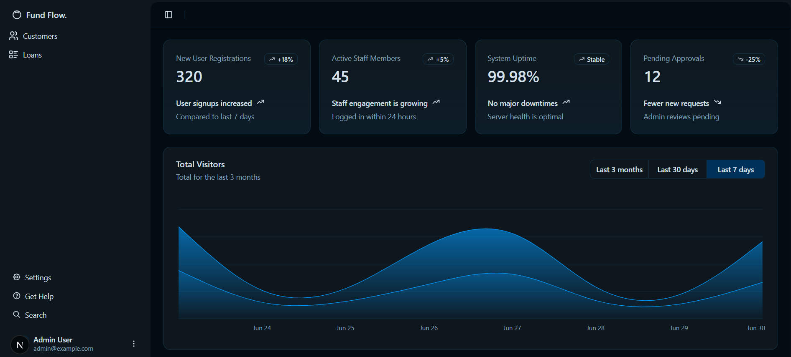
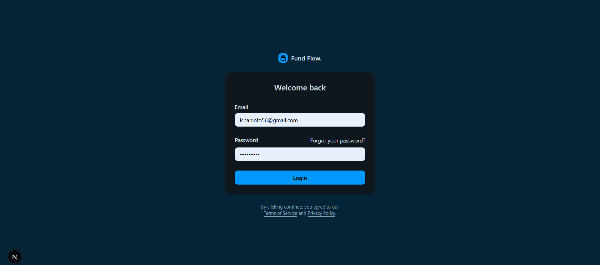
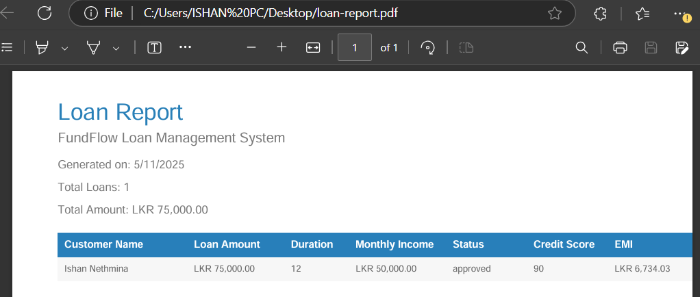
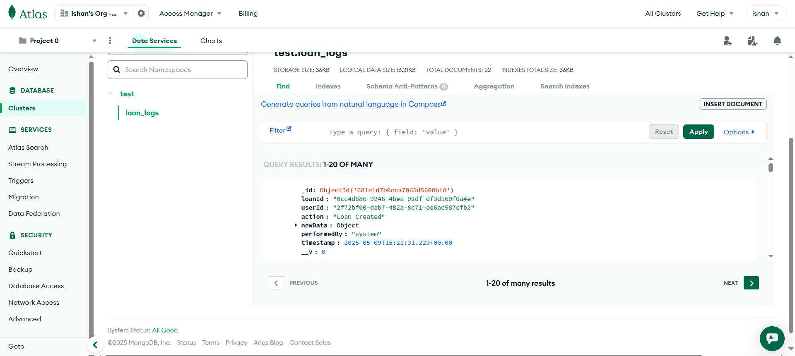
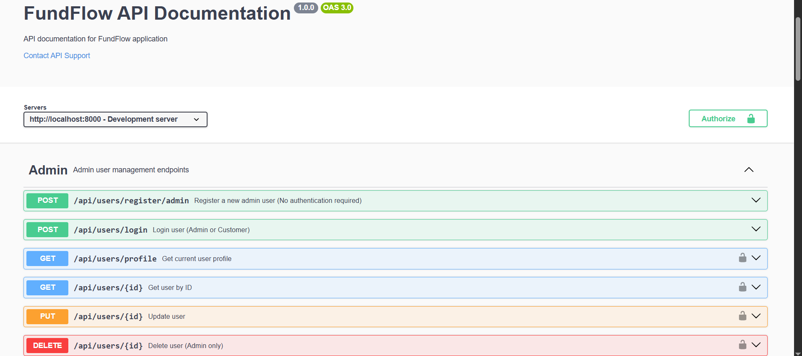

# 🏦 FundFlow - Microfinance Credit Scoring & Loan Management System


## 📋 Overview
FundFlow is a modern microfinance platform that streamlines loan processing and management. Built with Next.js and Node.js, it features a smart credit scoring algorithm and comprehensive admin dashboard.


*Admin Dashboard Overview*

## 🚀 Features

### 🔐 Authentication
- JWT-based authentication
- Role-based access (Admin/Customer)
- Secure login system


*Secure Login Interface*

### 👥 Customer Management
- Create and manage customer profiles
- Track customer credit scores
- View customer history

### 💰 Loan Processing
- Smart credit scoring algorithm
- Multiple loan applications
- Real-time status updates

### 📊 Admin Dashboard
- Comprehensive customer overview
- Loan application management
- Advanced filtering options


*Loan Application Reports*

### 📝 Logging System
- MongoDB-based logging
- Detailed transaction history
- Audit trail


*MongoDB Logging Interface*

## 🛠 Tech Stack

### Frontend
- ⚛️ Next.js 14
- 📘 TypeScript
- 🎨 Tailwind CSS
- 🧩 Shadcn UI Components
- 🔄 Axios for API calls
- 🔐 JWT Authentication

### Backend
- 🟢 Node.js
- 🚂 Express.js
- 🗄️ MongoDB
- 🔐 JWT Authentication
- 📡 RESTful API

## 🚀 Getting Started

### Prerequisites
- Node.js (v18 or higher)
- MySQL
- MongoDB
- npm or yarn

### Environment Setup

#### Backend (.env)
```env
PORT=8000
DB_HOST=localhost
DB_USER=root
DB_PASSWORD=your_db_password
DB_NAME=fundflowdb
JWT_SECRET=your_jwt_secret
MONGO_URI=mongodb://localhost:27017/fundflow_logs
```

#### Frontend (.env)
```env
NEXT_PUBLIC_API_URL=http://localhost:8000/api
```

### Installation

1. Clone the repository
```bash
git clone https://github.com/IsHaNinfo/FundFlow
cd FundFlow
```

2. Install dependencies
```bash
# Backend
cd backend
npm install

# Frontend
cd frontend
npm install
```

3. Start the servers
```bash
# Backend
cd backend
npm start

# Frontend
cd frontend
npm start
```

## 📚 API Documentation


*API Documentation Interface*

### 👤 User Management

| Method | Endpoint | Description | Auth Required |
| :-- | :-- | :-- | :-- |
| POST | `/api/users/register/admin` | Register a new admin user | No |
| POST | `/api/users/register/customer` | Register a new customer (admin only) | Admin |
| POST | `/api/users/login` | Login as admin or customer | No |
| GET | `/api/users/profile` | Get current user profile | Yes |
| GET | `/api/users/{id}` | Get user by ID | Yes |
| PUT | `/api/users/{id}` | Update user | Yes |
| DELETE | `/api/users/{id}` | Delete user (admin only) | Admin |
| GET | `/api/users` | Get all users (admin only) | Admin |
| GET | `/api/users/role/{role}` | Get users by role (`admin` or `customer`) | Admin |

### 👥 Customer Profile Management

| Method | Endpoint | Description | Auth Required |
| :-- | :-- | :-- | :-- |
| POST | `/api/customer-profiles` | Create a new customer profile | Admin |
| GET | `/api/customer-profiles` | Get all customer profiles (admin only) | Admin |
| GET | `/api/customer-profiles/{id}` | Get customer profile by ID | Yes |
| PUT | `/api/customer-profiles/{id}` | Update customer profile | Yes |
| DELETE | `/api/customer-profiles/{id}` | Delete customer profile (admin only) | Admin |
| GET | `/api/customer-profiles/user/{userId}` | Get customer profile by user ID | Yes |

### 💰 Loan Management

| Method | Endpoint | Description | Auth Required |
| :-- | :-- | :-- | :-- |
| POST | `/api/loans` | Create new loan application (customer only) | Customer |
| GET | `/api/loans` | Get all loans (admin only) | Admin |
| GET | `/api/loans/my-loans` | Get current user's loans | Yes |
| GET | `/api/loans/{id}` | Get loan by ID (admin or loan owner) | Yes |
| PUT | `/api/loans/{id}` | Update loan (admin or loan owner) | Yes |
| DELETE | `/api/loans/{id}` | Delete loan (admin only) | Admin |
| PUT | `/api/loans/{id}/status` | Update loan status (admin only) | Admin |

## 📦 Standard Response Structure
```json
{
  "status": 200,
  "data": { ... },
  "message": "Descriptive message"
}
```

## ⚠️ Error Codes
- **400**: Bad request (validation errors)
- **401**: Not authenticated or invalid token
- **403**: Not authorized (insufficient permissions)
- **404**: Resource not found
- **409**: Conflict (e.g., duplicate email or profile)

## 👥 Roles
- **Admin:** Can manage all users, customer profiles, and loans.
- **Customer:** Can manage own profile and loans.

## 💡 Credit Scoring Logic

The system calculates a score out of 100 based on:
- EMI ≤ 40% of monthly income
- Maximum 2 active loans
- Loan amount optimization
- Credit score consideration


```

## 🐳 Docker Support

Build and run with Docker Compose:
```bash
docker-compose up --build
```


